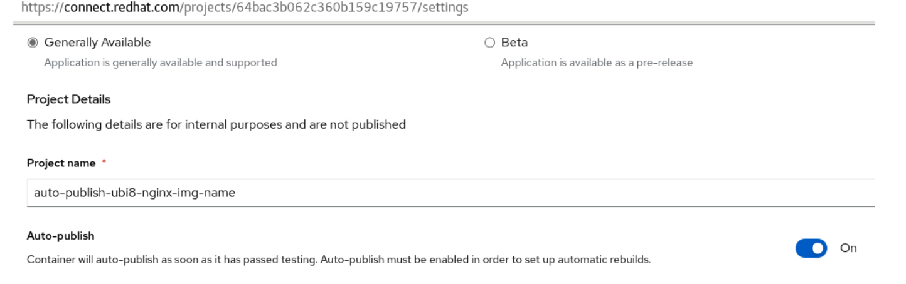
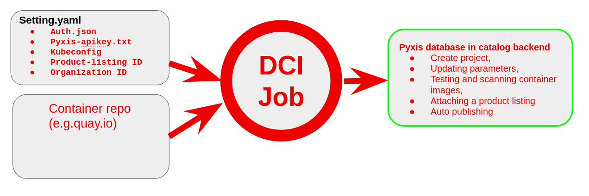
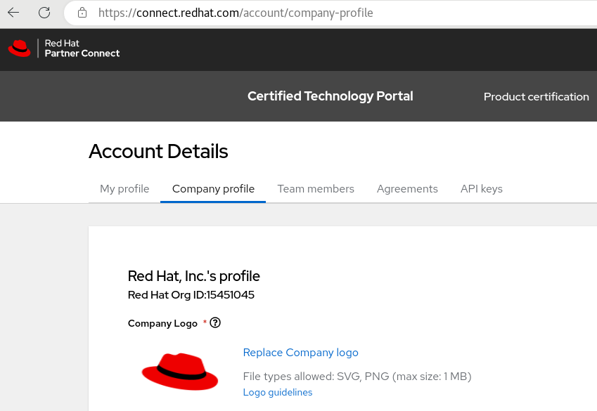
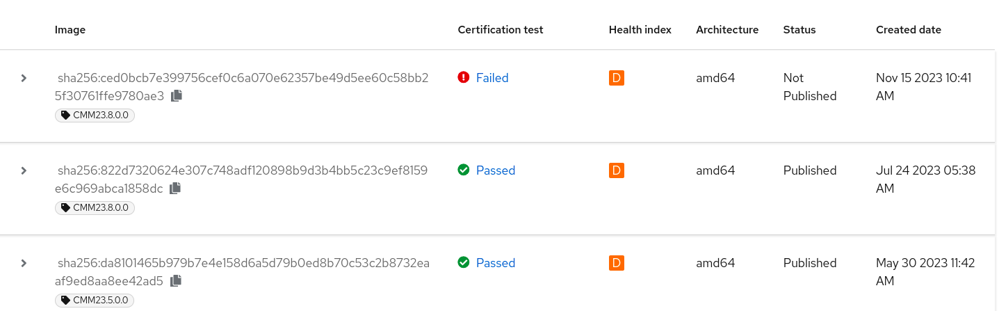

Table of Contents
=================

* [Table of Contents](#table-of-contents)
* [Introduction](#automate-certification-process-by-utilizing-dci-to-interact-with-the-certification-portal-backend)
   * [Prerequisites](#prerequisites)     
   * [Container Certification and Publish](#automation-container-certification-flow)
      * [ Container pre-testing](#auto-publish-preparations)
      * [Certify container and publish to eco-system catalog](#auto-publish-settings-configuration)
   * [Recertify Certification Container Projects](#recertify-certification-container-projects)
      * [Recertify Settings Configuration](#recertify-settings-configuration)
   * [E2E Automation Certification Of Operator Bundle Project](#e2e-automation-certification-of-operator-bundle-project)
      * [E2E Certification Settings Of Operator Bundle](#e2e-certification-settings-of-operator-bundle)
   * [Automate CNF Red Hat certified](#automate-creation-of-the-openshift-cnf-project-for-vendor-validated)
      * [Global Variables](#global-variables)
      * [Variables to define for each cnf_to_certify](#variables-to-define-for-each-cnf_to_certify)
      * [Variables to define for project settings under cert_listings main variable](#variables-to-define-for-project-settings-under-cert_listings-main-variable)
      * [Example Configuration of Openshift-cnf certification project creation](#example-configuration-of-openshift-cnf-certification-project-creation)
   * [Automate Helm Chart Certification Project](#automate-helm-chart-certification-project)
      * [Settings For Automate Helm Chart](#settings-for-automate-helm-chart)
      * [Helm Chart Deploy and PR Chain Settings](#helm-chart-deploy-and-pr-chain-settings)
   * [Automate Helm chart and CNF certification testing Together](#run-chart-verifier-and-tnf-suite-test-together)
      * [Example of chart-verifier and TNF Test Suite Settings Configuration](#example-of-chart-verifier-and-tnf-test-suite-settings-configuration)
   * [How to Run DCI Auto-publish, Recertify, Operator, HelmChart and Openshift-cnf Vendor validated](#how-to-run-dci-auto-publish-recertify-operator-helmchart-and-openshift-cnf-vendor-validated)
   * [Known Issues](#known-issues)
   * [Links](#links)

# Introduction

This article outlines a comprehensive automated certification process designed to facilitate the complete certification of Cloud-Native Network Functions (CNFs). This includes container certification, Helm chart certification, and/or operator certification, culminating in CNF certification. The procedure initiates with container certification, progresses through Helm chart certification, and culminates in CNF certification.

The scope of this process extends to both initial CNF certification and the recertification of new releases, utilizing the capabilities of the DCI tool. Additionally, it incorporates a method for automatic creation of Openshift-cnf certification projects, which are essential for Vendor Validation and subsequent CNF certification.

For new container certification, the process involves several key steps: the creation of a container project, updating or adding essential project parameters, conducting tests and scans on container images, linking container projects to a product listing, and ultimately, the automatic publication of container projects once they meet all criteria.

The certification process for Helm charts includes creating a Helm chart project, conducting chart tests, and submitting a pull request to merge the test report into the public chart repository.

In the realm of CNF certification, the process entails the creation of a CNF project, executing CNF tests, and uploading the test report into the project. This approach efficiently integrates Vendor Validation and CNF certification tasks within a single Openshift CNF project workflow. Under this system, Vendor Validation, which must be completed and published prior to initiating the CNF certification task, is a prerequisite. The commencement of CNF certification is optional and contingent on the outcomes of Vendor Validation.
 
 
## Prerequisites

- Set up a jumphost with internet access, install the dci-openshift-appagent, detailed guide can be found in this link [dci-openshift-app-agent-install](https://doc.distributed-ci.io/dci-openshift-app-agent/) 
- It is recommended consistently check latest version of the DCI app agent package, and upgrade to latest version if it not before to use
    
  ```bash
$ sudo dnf upgrade --refresh --repo dci -y

```
- If the upgrade or re-installation of the latest DCI repository is not functioning correctly, try using the "install-dci-packages" method provided in the following link above
```bash	
  $ sudo dnf remove dci-openshift-app-agent -y

$ sudo dnf install dci-openshift-app-agent -y

```
- DCI Control server credential create remote-ci credentials
- Prepare settings.yml for container and CNF projects information
The details of each container certification project type are shown on next sections


- Set auto-publish parameter to ON under container project settings tab (connect.redhat.com)

- DCI Control server credential
  [create remote-ci credentials](https://www.distributed-ci.io/remotecis)
- Prepare settings.yml for container and CNF projects information  
  The details of each container certification project type are shown on next sections
- Set `auto-publish` parameter to `on` under container project settings tab
  

  
## Automation Container Certification Flow


### Container Certification and Publish
#### Container pre-testing

When preparing for container certification for the first time, it is suggested to utilize the preflight test tool in a distinct stage. Initially, conducting a pre-test allows for a thorough examination of the container, pinpointing any potential issues that might lead to failure in the actual certification phase. Once these issues are identified and reported, the partner engineering team can then focus on resolving these problems and subsequently re-verify the solutions using the pre-testing procedure.

DCI configuration and prerequites for pre-testing.

- OCP and DCI ENV (included dcirc.sh,install.yml etc..)
Any OCP Cluster and a helper node with DCI RPM packages installed  
- Settings.yml 
A Settings with DCI auto-publish enhancement feature 
- Auth.json 
Docker Authentication file to access OCI compatible container repo on partner private registry. Here is a example of using quay.io registry and run podman/docker on your jumphost and linux machine. 
- Login to your private registry server   
```bash
$ podman login -u testuser quay.io
```
- use echo command to locate your auth.json file for your private registry: 
```
$ echo $XDG_RUNTIME_DIR
 /run/user/4205315/containers/auth.json
```  
For more info can be found this link If you are using other OCI compatible container repository, just get auth.json ready for tool to use  
- Pyxis-apikey.txt 
A token to access specific partner portal( connect.redhat.com) Pyxis  data using REST API. Create Pyxis API Key 
- Kubeconfig 
A kubeconfig that is used to access the OCP cluster on which CNF with all its artifacts will either be deployed or has already been deployed for CNF certification test 
- Product-listing ID 
Before a container or helm chart/operator can be publicly listed into RedHat catalog, a Product-Listing must be created, it only needs to be created once according to CNF type. Follow this link to [Create-Product-Listing](https://connect.redhat.com/manage/products) 
- Organization ID 
Mandatory when using create_container_project. Company ID will be used for the verification of the container certification project Organization-ID Company-Profile. 
Login to your private registry server: 
```shellSession
$ podman login -u testuser quay.io
$ echo $XDG_RUNTIME_DIR
/run/user/4205315/containers/auth.json
```
- **Pyxis-apikey.txt**    
A token to access specific partner Pyxis catalog data using REST API. [Create Pyxis API Key](https://connect.redhat.com/account/api-keys) 
- **Kubeconfig** 
A kubeconfig that can access the OCP cluster 
- **Product-listing ID** 
Before a container or helm chart/operator can be publicly listed into RedHat catalog, a Product-Listing must be created, it only need to create once according to CNF type.
Follow this link to [Create-Product-Listing](https://connect.redhat.com/manage/products)
- **Organization ID** 
Mandatory when using create_container_project. Company ID will be used for the verification of container certification project Organization-ID Company-Profile.
 

### DCI Settings.yaml Configuration with project creation, product listing attachming and auto publishing
settings.yml:

```yaml
---
dci_topic: OCP-4.12
dci_name: Testing DCI to create certification Project Automatic and Update mandatory settings and publish
dci_configuration: Using DCI create project,update,submit result and auto-publish
preflight_test_certified_image: true
check_for_existing_projects: true
#ignore_project_creation_errors: true
dci_config_dirs: [/etc/dci-openshift-agent]
partner_creds: "/var/lib/dci-openshift-app-agent/auth.json"
organization_id: 12345678
preflight_containers_to_certify:
  - container_image: "quay.io/avu0/auto-publish-ubi8-nginx-demo1:v120"
    create_container_project: true
    short_description: "I am doing a full-automation e2e auto-publish for following image auto-publish-ubi8-nginx-demo1:v120"
  - container_image: "quay.io/avu0/auto-publish-ubi8-nginx-demo2:v120"
    create_container_project: true
    short_description: "I am doing a full-automation e2e auto-publish for following image auto-publish-ubi8-nginx-demo2:v120"

cert_settings:
   auto_publish: false
   build_categories: "Standalone image"
   registry_override_instruct: "<p>This is an instruction how to get the image link.</p>"
   email_address: "whoami@redhat.com"
   application_categories: "Networking"
   os_content_type: "Red Hat Universal Base Image (UBI)"
   privileged: false
   release_category: "Generally Available"
   repository_description: "This is a test for Demo how to automate to create project, SCAN and update settings"

cert_listings:
  attach_product_listing: true
  published: true
  type: "container stack"
  pyxis_product_list_identifier: "yyyyyyyyyyyyyyyyy"  # product list id for container projects

pyxis_apikey_path: "/var/lib/dci-openshift-app-agent/pyxis-apikey.txt"
dci_gits_to_components: []

```
## Recertify Certification Container Projects

For subsequent re-certification processes, a similar approach can be employed to recertify a new release of an already certified container within the same project. DCI is also capable of recertifying existing, active certification projects by incorporating a new release version and tag.

Main prodedures for container re-certication:

- Identify the certification projects that need to be recertified  
- Update the certification project's release version and tag to the new release version and tag  
- Run DCI to embed Preflight to retest the container of new release and submit new report to current container project in partner portal  
- Confirm and verify the project information under the project, then publish it to the catalog for completion recertification.  
  
Please note that these are just general steps and may vary depending on the specific project. And also basic and general requirements to run `recertify` the container projects please use follow this [section](https://github.com/ansvu/cnf-certification-automation-with-dci/tree/main#auto-publish-preparations)

### Recertify Settings Configuration
```yaml
---
dci_topic: OCP-4.12
dci_name: Testing DCI to Recertify the certification container projects
dci_configuration: Using DCI to Recertify the Certification container Project
check_for_existing_projects: true
organization_id: 12345678
dci_config_dirs: [/etc/dci-openshift-agent]
partner_creds: "/var/lib/dci-openshift-app-agent/auth.json"
preflight_containers_to_certify:
  - container_image: "quay.io/avu0/auto-publish-ubi8-nginx-demo1:v121"
    pyxis_container_identifier: "111111111111111111111111"
  - container_image: "quay.io/avu0/auto-publish-ubi8-nginx-demo2:v121"
    pyxis_container_identifier: "222222222222222222222222"

pyxis_apikey_path: "/var/lib/dci-openshift-app-agent/pyxis-apikey.txt"
dci_gits_to_components: []
...
```
This parameter `pyxis_container_identifier` is the container certification project from backend GUI.  
There are two ways to get this container certification project-id.
- Using REST API to access the backend
```bash
$ curl --silent -X 'GET'  'https://catalog.redhat.com/api/containers/v1/vendors/org-id/nnnnn/projects/certification?page_size=200&page=0'   -H 'accept: application/json' -H "X-API-KEY: xxxxxxxxxxxxxxxxxxxxx"|jq -r '.data[] | select(.name | startswith("imageprefix-")) | .name+": "+._id'
```
- Uing backend GUI from connect.redhat.com
  Click on an existing container certification project like this:
  https://connect.redhat.com/projects/64ff6eea4f57e362ac17a699/overview
  This ID `64ff6eea4f57e362ac17a699` is the project-id

Note: When recertifying a container project, any changes within the container image layers will alter the image's digest. For example, suppose busybox:v1 is already certified and published to the catalog. If there's an update or change to the busybox image, generating a new image tag busybox:v2, the preflight scan will examine and submit the results of the container image for busybox:v2 as the second entry result from the backend. Even if the user chooses to keep the original tag v1, the preflight will still submit the result as the second entry result with the same image name busybox:v1 but a different sha256 value.

Example,
 


## E2E Automation Certification Of Operator Bundle Project
This represents a new enhancement to the end-to-end (E2E) certification process for operators in conjunction with DCI. It involves the automation of updates and the attachment of product listings. Tatiana, a member of the DCI team, has authored a blog post that contains specific information about the prerequisites and settings related to this improvement. You can access the blog post by following this link: [end-to-end-certification-of-operators-with-dci](https://blog.distributed-ci.io/preflight-integration-in-dci.html#end-to-end-certification-of-operators-with-dci).

**Note:** The forthcoming section will introduce new changes to the settings, which will be provided in detail. Additionally, there will be a new collaborative blog post with the DCI team, delving into these recent enhancements to DCI certification.


### E2E Certification Settings Of Operator Bundle
Similar settings configuration requirements of container certification project with a slightly differences suchas `github_token_path` as additional to `pyxis_product_list_identifier`, `partner_creds`(auth.json), `organization_id` and `pyxis_apikey_path`. 

Name                     | Default                                                                    | Description
-------------------      | ------------                                                               | -------------
create_operator_project  | false                                                                      | If set to true, it will create a new a new "Operator Bundle Image" and submit test results in it
attach_product_listing   | false                                                                      | If e2e certification then this parameters need to set to `true` to attach the product-listing ID to project.
create_pr                | none                                                                       | If defined, Optional; use it to open the certification PR automatically in the certified-operators repository
merge_pr                 | false                                                                      | If defined, Optional; use it to merge the certification PR automatically in the certified-operators repository
page_size                | 200                                                                        | If defined, Optional; in case there are many archived or active projects are in the account, update if >= 200
github_token_path        | none                                                                       | Optional; if create_pr sets to true then it requires to generate the github-token, follow [generate a github token](https://github.com/redhatci/ansible-collection-redhatci-ocp/tree/main/roles/create_certification_project#github-token)
check_for_existing_projects | false                                                                   | If create_operator_project sets to `true`, then this parameter `check_for_existing_projects` need to set to `true` to check if project is already existed.
organization_id          |                                                                            | If create_operator_project sets to `true`, then `organization_id` need to be defined with the account associates to this organization ID. 
auto_publish             | false                                                                      | If e2e auto-publish the operator certification then set to `true` under `cert_settings`
published                | false                                                                      | Similar to auto_publish purpose if e2e certification is the purpose then set to `true` under `cert_listings`
pyxis_product_list_identifier |                                                                       | This product-listing ID must create manually and define here when attach_product_listing sets to `true` in cert_listings section

Note: Parameters from cert_settings and cert_listings are mandatory 
```yaml
---
dci_topic: OCP-4.13
dci_name: Testing e2e creation operator bundle project and PR
dci_configuration: Using DCI to scan simple operator image.
check_for_existing_projects: true
dci_config_dirs: [/etc/dci-openshift-app-agent]
partner_creds: "/var/lib/dci-openshift-app-agent/demo-auth.json"
organization_id: 15451045
do_must_gather: false
preflight_run_health_check: false
page_size: 300
github_token_path: "/var/lib/dci-openshift-app-agent/dummy-git-token.txt"
# you could provide many operators at once.
preflight_operators_to_certify:
  - bundle_image: "quay.io/avu0/ava4-simple-demo-operator-bundle:v0.0.6"
    index_image: "quay.io/avu0/ava4-ark-simple-demo-operator-catalog:v0.0.6"
    short_description: "Describe specific about your operator bundle image"
    create_operator_project: true
    create_pr: true
    merge_pr: false

cert_settings:
   auto_publish: false
   registry_override_instruct: "<p>How to get this operator image.</p>"
   email_address: "me@redhat.com"
   application_categories: "Networking"
   privileged: false
   repository_description: "Repository Description"

cert_listings:
  published: false
  type: "container stack"
  pyxis_product_list_identifier: "yyyyyyyyyyyyyyyyyyyyyyyy"
  attach_product_listing: true

pyxis_apikey_path: "/var/lib/dci-openshift-app-agent/demo-pyxis-apikey.txt"
dci_gits_to_components: []
...
```

## Automate creation of the Openshift-cnf project for Vendor Validated
This feature automatically generates an OpenShift-CNF certification project when this option `create_cnf_project` set to `true`. The new feature reuses some tasks from the `create-certification-project` role, and the associated templates are stored within this feature. Currently, there are no mandatory parameters that need to be updated in the new feature.

Please note that the feature openshift-cnf is currently a basic automation setup. It will undergo further updates once additional options are available from the backend REST API, such as `{"certification_level":"Certified"}` parameter for starting the Certify the functionality of your CNF on Red Hat OpenShift step within the project.


### Global Variables
As the new role openshift-cnf reuses some existing tasks, please refer to the description in the `create-certification-project` role for information on the shared global variables.


### Variables to define for each cnf_to_certify

Name                     | Default                                                                    | Description
-------------------      | ------------                                                               | -------------
attach_product_listing   | false                                                                      | If set to true, it would attach product-listing to Openshift-cnf certification project
create_cnf_project       | false                                                                      | If set to true, it will create a new Openshift-cnf certification project.
cnf_name                 | None                                                                       | If defined, it would create Openshift-cnf certification project for vendor validated, cnf_name format: `CNF25.8 + OCP4.12`

### Variables to define for project settings under `cert_listings` main variable

Name                          | Default                              | Description
----------------------------- | ------------------------------------ | -------------
attach_product_listing        | false                                | If set to true, it will attach product-listing to Openshift-cnf certification project.
pyxis_product_list_identifier | None                                 | Product-listing ID, it has to be created before. [See doc](https://redhat-connect.gitbook.io/red-hat-partner-connect-general-guide/managing-your-account/product-listing)
published                     | false                                | Boolean to enable publishing list of products
type                          | "container stack"                    | String. Type of product list
email_address                 | "mail@example.com"                   | String. Email address is needed for creating openshift-cnf project

### Example Configuration of Openshift-cnf certification project creation
```yaml
---
dci_topic: OCP-4.11
dci_name: Testing Openshift-cnf auto creation and attach
dci_configuration: Using DCI create cnf project and attach product-list
check_for_existing_projects: true
dci_config_dirs: [/etc/dci-openshift-agent]
partner_creds: "/var/lib/dci-openshift-app-agent/auth.json"
organization_id: 12345678
#cnf_name is a free-text but format: CNF-version + OCP-version e.g "CNF23.5 OCP4.12.9"
cnf_to_certify:
  - cnf_name: "test-smf23.5 OCP4.11.5"
    create_cnf_project: true

  - cnf_name: "test-upf23.5 OCP4.11.5"
    create_cnf_project: true

cert_listings:
  attach_product_listing: true
  email_address: "email@example.com"
  published: false
  type: "container stack"
  pyxis_product_list_identifier: "yyyyyyyyyyyyyyyyy" #7GC UDM

pyxis_apikey_path: "/var/lib/dci-openshift-app-agent/pyxis-apikey.txt"
dci_gits_to_components: []
...
```
**Note:** New and recertified container image projects can be included in the same settings.yml file, but new container certification projects require more detailed descriptions and additional parameters in the cert_setting section. This is so that partners can easily distinguish between new and recertified images.

For recertified container projects, if partners have not yet enabled auto-publish for the projects from the portal Gui, they must manually enable it before using the DCI to automate the certification process.

## Automate Helm Chart Certification Project
This new helm chart feature will automate creating the helm chart certification projects, update mandatory parametes and attach the product-listing with option to set auto-publish on or off.

### Settings For Automate Helm Chart
Note: For this automation to work, both cert_settings and cert_listings are mandatory.

Name                     | Default                                                                    | Description
-------------------      | ------------                                                               | -------------
create_helmchart_project | false                                                                      | If set to true, it would create a new helm chart certification project
attach_product_listing   | false                                                                      | If set to `true` it will attach the product-listing ID to project
repository               | none                                                                       | Define the repository helmchart name
distribution_method      | false                                                                      | Two options to choose 1. undistributed(Web catalog:Recommended) 2.external(charts.openshift.io)
chart_name               | none	                                                                      | Define a chartname that will be create on backend and it will be the same chartname in OWNERS file
short_description        | none                                                                       | Describe specific about this helm chart functional
github_usernames         | none                                                                       | Define github username here that will be updated on OWNERS file
published                | false                                                                      | If it sets to `true`, it will set publish on in product-listing
organization_id          |                                                                            | If create_operator_project sets to `true`, then `organization_id` need to be defined with the account associates to this organization ID. 
pyxis_product_list_identifier |                                                                       | This product-listing ID must create manually and define here when attach_product_listing sets to `true` in cert_listings section
pyxis_apikey_path        |                                                                            | As usual when create project on Backend, pyxis API-key is required

Other parameters are under cert_settings and cert_listings are not mentioned above, but they are mandatory and update accordingly to its meaning.

```yaml
---
dci_topic: OCP-4.12
dci_name: Testing DCI to create certification Project for Helm Chart Automatic
dci_configuration: Use DCI to Automate Helm Chart Project Creation
check_for_existing_projects: true
dci_config_dirs: [/etc/dci-openshift-agent]
organization_id: 15451045
do_must_gather: false
page_size: 300
helmchart_to_certify:
  - repository: "https://github.com/ansvu/testchart13"
    short_description: "This is a short description testchart13"
    chart_name: "testchart13"
    create_helmchart_project: true

cert_settings:
   email_address: "helmchart@redhat.com"
   distribution_method: "undistributed"
   github_usernames: "ansvu"
   application_categories: "Networking"
   long_description: "This is a long description about this sample chart"
   distribution_instructions: "You must be present to get this helm-chart!"

cert_listings:
  attach_product_listing: true
  published: false
  type: "container stack"
  pyxis_product_list_identifier: "yyyyyyyyyyyyyyyyyyyyyyyyyyyyyyyyy"

pyxis_apikey_path: "/var/lib/dci-openshift-app-agent/demo-pyxis-apikey.txt"
dci_gits_to_components: []
...
```
After helm chart cert project is created, it will populate the information into OWNERS file as following or [OWNERS](https://github.com/openshift-helm-charts/charts/blob/main/charts/partners/redhat-arkady-test/testchart13/OWNERS)
```yaml
chart:
  name: testchart13
  shortDescription: This is a short description testchart13
providerDelivery: true
publicPgpKey: unknown
users:
- githubUsername: ansvu
vendor:
  label: redhat-arkady-test
  name: Red Hat, Inc.
```

### Helm Chart Deploy and PR Chain Settings
Upon the creation of the Helm chart certification project, we have the option to utilize the chained settings configuration from the preceding section to initiate the deployment of the Helm chart. Subsequently, we can submit a pull request (PR) for merging. It's crucial to note that there are a couple of vital prerequisites in place. Firstly, a pre-test of the Helm chart using the chart-verifier must be conducted to generate a report.yaml file, ensuring the successful completion of all chart-verifier test cases before the merge can proceed. Secondly, it is imperative that the container certification has been published in the catalog and that the corresponding images are available within the catalog as well.

If you want to test helm chart PR without submit to Catalog, then please following this [sandbox-repository](https://softwarefactory-project.io/r/plugins/gitiles/dci-openshift-app-agent/+/35b28a7f30603a17d5567ebc82b2a3e2f8027d34/roles/chart-verifier)
```yaml
---
do_chart_verifier: true
dci_openshift_app_ns: avachart
partner_name: telcoci SampleChart
partner_email: telco.sample@redhat.com
github_token_path: "/opt/cache/token.txt"
dci_charts:
  - name: testchart13
    chart_file: https://github.com/ansvu/samplechart2/releases/download/samplechart-0.1.3/samplechart-0.1.3.tgz
    #chart_values: https://github.com/ansvu/samplechart2/releases/download/samplechart-0.1.3/values.yaml
    #install: true
    deploy_chart: true
    create_pr: true
```


## Run Chart Verifier and TNF Suite Test Together
This section will show to use DCI to run chart-verifier with option `-c` or `--skip-cleanup` so CNF helm chart deploys and leave CNF PODs running then using DCI to test the TNF suite base CNF namespace. 

### Example of chart-verifier and TNF Test Suite Settings Configuration
```yaml
---
dci_topic: OCP-4.11
dci_name: Chart-verifier with TNF Suite testing
dci_configuration: DCI Chart-verifier SampleChart + TNF Suite testing
dci_openshift_app_image: quay.io/testnetworkfunction/cnf-test-partner:latest
do_chart_verifier: true
dci_openshift_app_ns: avachart
do_must_gather: false
check_workload_api: false
partner_name: telcoci SampleChart
partner_email: telco.sample@redhat.com
github_token_path: "/opt/cache/token.txt"
dci_charts:
  - name: testchart13
    chart_file: https://github.com/ansvu/samplechart2/releases/download/samplechart-0.1.3/samplechart-0.1.3.tgz
    #chart_values: https://github.com/ansvu/samplechart2/releases/download/samplechart-0.1.3/values.yaml
    #install: true
    deploy_chart: true
    flags: "-c -W"
    create_pr: false

do_cnf_cert: true
tnf_labels: common,telco,extended
tnf_log_level: trace
tnf_config:
  - namespace: avachart
    targetNameSpaces:
      - avachart
    operators_regexp:
    exclude_connectivity_regexp:
test_network_function_version: v4.2.4
dci_gits_to_components: []
...
```
Note: Some cases where partner wants to deploy CNF and leave it running and do not want to teardown CNF. So with new feature from chart-verifier `1.12.1`, it adds `-c` option to allow users to skip the `cleanup` e.g. `helm uninstall`. 

Result can be seen from DCI Job Server then click [here](https://www.distributed-ci.io/jobs/c65dae62-d2bb-4b28-becf-ff0975130851)

## How to Run DCI Auto-publish, Recertify, Operator, HelmChart and Openshift-cnf Vendor validated
- Login to DCI user  
```shellSession
$ su - dci-openshift-app-agent
```
- Prepare a settings file for different type of certification projects accordingly
  - [Auto Publish New Container Certification Project Settings](https://github.com/ansvu/cnf-certification-automation-with-dci/tree/main#auto-publish-settings-configuration)
  - [Recertify Container Certification Project Settings](https://github.com/ansvu/cnf-certification-automation-with-dci/tree/main#recertify-settings-configuration)
  - [E2E Certification of Operator Bundle Settings](https://github.com/ansvu/cnf-certification-automation-with-dci#e2e-certification-settings-of-operator-bundle)
  - [Automate Helm Chart Certification Settings](https://github.com/ansvu/cnf-certification-automation-with-dci#settings-for-automate-helm-chart)
  - [Openshift-cnf Certification Project Vendor Validated Settings](https://github.com/ansvu/cnf-certification-automation-with-dci/tree/main#example-configuration-of-openshift-cnf-certification-project-creation)
- Export KUBECONFIG  
```shellSession
$ export KUBECONFIG=/var/lib/dci-openshift-app-agent/kubeconfig
```
- Start RUN DCI OpenShift App Agent  
```shellSession
$ dci-openshift-app-agent-ctl -s -- -vv
```
## Known Issues

- Must gather log disable

For partners with larger OpenShift clusters and disconnected labs, running DCI for container image automation and recertification can pose challenges. Uploading the must-gather log, which collects OCP logging data, becomes problematic due to its size. This can cause DCI to get stuck for over 2 hours as it retries unsuccessfully through the partner's proxy.

A solution is to disable must-gather log collection, the set `do_must_gather: false` to settings.yml. This allows DCI to proceed without uploading the large logs and avoids proxy-related issues.  

## Links
- [dci-openshift-app-agent](https://doc.distributed-ci.io/dci-openshift-app-agent/)
- [dci-packages](https://blog.distributed-ci.io/install-openshift-on-baremetal-using-dci.html#dci-packages)
